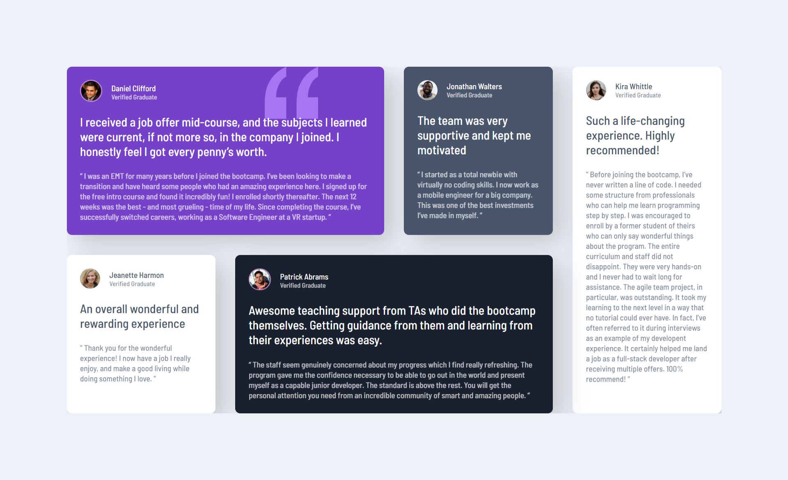

# Frontend Mentor - Testimonials grid section solution

This is a solution to the [Testimonials grid section challenge on Frontend Mentor](https://www.frontendmentor.io/challenges/testimonials-grid-section-Nnw6J7Un7). Frontend Mentor challenges help you improve your coding skills by building realistic projects. 

## Table of contents

- [Overview](#overview)
  - [Screenshot](#screenshot)
  - [Links](#links)
- [My process](#my-process)
  - [Built with](#built-with)
  - [What I learned](#what-i-learned)
  - [Useful resources](#useful-resources)
- [Author](#author)

### The challenge

Users should be able to:

- View the optimal layout for the site depending on their device's screen size
- The layout works for all screen sizes from Tablets to Laptops and Mobiles Phones

### Screenshot
### Desktop Screenshot

### Mobile Screenshot

### Links

- Solution URL: [Add solution URL here](https://your-solution-url.com)
- Live Site URL: [Add live site URL here](https://your-live-site-url.com)

### Built with

- Semantic HTML5 markup
- CSS custom properties
- Flexbox
- CSS Grid
- Mobile-first workflow

### What I learned
Learned about the minmax() function of grid display property and how it can be used to make responsive layouts

### Useful resources

- [CSS TRICKS](https://css-tricks.com/snippets/css/complete-guide-grid/) - For basic grid understanding
- [CSS TRICKS](https://css-tricks.com/snippets/css/a-guide-to-flexbox/) - For basic flexbox understanding

## Author

- Frontend Mentor - [@suraj-singh127](https://www.frontendmentor.io/profile/suraj-singh127)